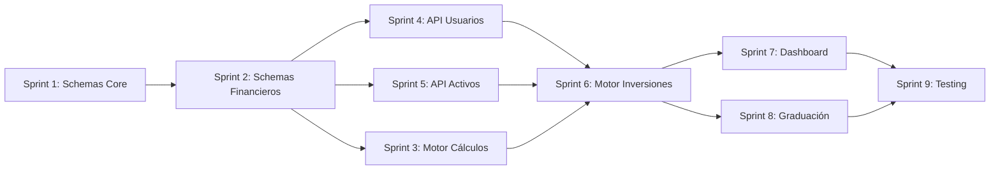

# ROADMAP DE IMPLEMENTACIÓN CPII - 9 SPRINTS

**Proyecto:** Club Privado de Inversión Inmobiliaria  
**Duración total:** 18 semanas (2 semanas/sprint)  
**Fecha inicio:** 2026-02-17  
**Metodología:** Desarrollo incremental con entregables funcionales  

---

## SPRINT 1: Fundamentos y Schemas Core (Semanas 1-2)

| Aspecto | Detalle |
|---------|---------|
| **Features** | • Schemas TypeScript de entidades base (Usuario, KYC, Red) • Modelos de datos en memoria • Validaciones básicas con Zod • Setup proyecto Node.js + TypeScript |
| **Fuente** | • `02-arquitectura-datos-cpii.md` → Schemas de Entidades Core (líneas 29-75) • `01-ontologia-glosario-cpii.md` → Roles y Actores (líneas 59-175) |
| **Agente recomendado** | **Claude** (excelente en TypeScript y arquitectura de datos) |
| **Criterio completitud** | ✅ Interfaces Usuario, PerfilUsuario, EstadoKYC, EstructuraRed compilables ✅ Tests unitarios de validación (Zod) ✅ Documentación JSDoc completa |

---

## SPRINT 2: Schemas Financieros y Activos (Semanas 3-4)

| Aspecto | Detalle |
|---------|---------|
| **Features** | • Schemas ActivoInmobiliario, VentanaInversion, Inversión, Comisión • Enums de estados y tipos • Relaciones entre entidades • Mock data generator |
| **Fuente** | • `02-arquitectura-datos-cpii.md` → Activo Inmobiliario (líneas 78-157) • `02-arquitectura-datos-cpii.md` → Ventana de Inversión (líneas 160-193) • `02-arquitectura-datos-cpii.md` → Inversión y Comisión (líneas 198-253) |
| **Agente recomendado** | **Claude** (coherencia en modelado de datos complejos) |
| **Criterio completitud** | ✅ Todos los schemas de negocio implementados ✅ Relaciones FK correctas (usuario → inversión → ventana) ✅ Generador de datos de prueba funcional |

---

## SPRINT 3: Motor de Cálculos Financieros (Semanas 5-6)

| Aspecto | Detalle |
|---------|---------|
| **Features** | • Cálculo de comisiones Revenue Share (3 niveles: 1%, 0.5%, 0.25%) • Cálculo beneficio neto (Tier A/B) • Proyecciones patrimoniales (1-15 años) • Simulador de autofinanciación |
| **Fuente** | • `02-arquitectura-datos-cpii.md` → Modelos de Negocio Tier A/B (líneas 304-401) • `02-arquitectura-datos-cpii.md` → Modelo Revenue Share (líneas 405-441) • `simulacion_cii_24m.csv` → Dataset de referencia |
| **Agente recomendado** | **Gemini** (excelente en cálculos matemáticos y validación numérica) |
| **Criterio completitud** | ✅ Función `calcularComisionesRed()` validada vs CSV ✅ Función `calcularBeneficioNeto()` para Tier A/B ✅ Función `proyeccionPatrimonial()` con ±5% precisión ✅ Tests de regresión con datos CSV |

---

## SPRINT 4: API REST - Usuarios y Onboarding (Semanas 7-8)

| Aspecto | Detalle |
|---------|---------|
| **Features** | • Endpoints: POST /usuarios, GET /usuarios/:id, PATCH /usuarios/:id • Workflow onboardingInversor (registro → KYC → activación prescriptor) • Generación enlace de invitación • Registro en árbol genealógico (L1-L2-L3) |
| **Fuente** | • `03-flujos-procesos-cpii.md` → Onboarding Inversor (líneas 74-128) • `03-flujos-procesos-cpii.md` → Registro en Red (líneas 110-128) • `01-ontologia-glosario-cpii.md` → Inversor/Prescriptor (líneas 99-134) |
| **Agente recomendado** | **ChatGPT** (rápido en APIs REST estándar con Express/Fastify) |
| **Criterio completitud** | ✅ 3 endpoints operativos con validación ✅ Workflow completo de onboarding ejecutable ✅ Árbol genealógico correctamente propagado (L1→L2→L3) ✅ Tests de integración end-to-end |

---

## SPRINT 5: API REST - Activos y Ventanas (Semanas 9-10)

| Aspecto | Detalle |
|---------|---------|
| **Features** | • Endpoints: POST /activos, GET /activos/:id, POST /activos/:id/nivel2 • Endpoints: POST /ventanas, GET /ventanas/activa, POST /ventanas/:id/cerrar • Workflow captarActivo (draft → nivel2 → revisión → published) • Workflow apertura/cierre ventanas trimestrales |
| **Fuente** | • `03-flujos-procesos-cpii.md` → Captación de Activo (líneas 266-346) • `03-flujos-procesos-cpii.md` → Apertura/Cierre Ventana (líneas 419-468) • `02-arquitectura-datos-cpii.md` → Schemas Activo y Ventana (líneas 78-193) |
| **Agente recomendado** | **ChatGPT** (eficiente en CRUD y workflows lineales) |
| **Criterio completitud** | ✅ CRUD completo de activos con validación Nivel 2 ✅ CRUD de ventanas con calendario Q1-Q4 ✅ Workflow de captación funcional (draft → published) ✅ Tests de estados de activo y ventana |

---

## SPRINT 6: Motor de Inversiones y Comisiones (Semanas 11-12)

| Aspecto | Detalle |
|---------|---------|
| **Features** | • Endpoints: POST /inversiones, GET /inversiones, POST /inversiones/:id/comisiones • Workflow cicloAhorroInversion (ahorro mensual → acumulación trimestral → inversión) • Generación automática de comisiones multinivel al invertir • Liquidación de comisiones en cierre de ventana |
| **Fuente** | • `03-flujos-procesos-cpii.md` → Ciclo Ahorro e Inversión (líneas 132-168) • `03-flujos-procesos-cpii.md` → Generación Comisiones Red (líneas 170-215) • `03-flujos-procesos-cpii.md` → Liquidación Ventana (líneas 470-500) |
| **Agente recomendado** | **Claude** (mejor en lógica compleja con múltiples actores y propagación) |
| **Criterio completitud** | ✅ Sistema de ahorro mensual funcional ✅ Inversión trimestral automatizada ✅ Comisiones propagadas correctamente (L1→L2→L3) ✅ Liquidación calcula beneficio neto y dota Fondo Sostenibilidad (50%) |

---

## SPRINT 7: Dashboard y Métricas en Tiempo Real (Semanas 13-14)

| Aspecto | Detalle |
|---------|---------|
| **Features** | • Dashboard de inversor (patrimonio, comisiones, red L1-L2-L3) • Dashboard de gestor (volumen gestionado, semáforo salud) • Métricas del sistema (tasa prescripción, salud Fondo, tiempo autofinanciación) • Gráficos de proyección patrimonial |
| **Fuente** | • `02-arquitectura-datos-cpii.md` → Patrimonio y EstructuraRed (líneas 66-74) • `02-arquitectura-datos-cpii.md` → SeccionCertificada (líneas 257-288) • `simulacion_cii_24m.csv` → Datos de referencia para proyecciones |
| **Agente recomendado** | **ChatGPT** (rápido en UI/UX con React y componentes de gráficos) |
| **Criterio completitud** | ✅ Dashboard inversor con patrimonio en tiempo real ✅ Dashboard gestor con semáforo de salud ✅ 5 KPIs principales visualizados ✅ Gráficos de proyección patrimonial interactivos |

---

## SPRINT 8: Graduación a Gestor y Compliance (Semanas 15-16)

| Aspecto | Detalle |
|---------|---------|
| **Features** | • Workflow procesarGraduacionGestor (validar 1M€ + 24 meses + semáforo verde) • Creación de SeccionCertificada (50% matriz, 50% gestor) • Sistema de monitorización (semáforo verde/amarillo/rojo) • Workflow de intervención (Takeover si semáforo rojo) |
| **Fuente** | • `03-flujos-procesos-cpii.md` → Graduación Gestor (implícito, referenciado) • `01-ontologia-glosario-cpii.md` → Gestor de Sección (líneas 148-175) • `02-arquitectura-datos-cpii.md` → SeccionCertificada (líneas 257-288) |
| **Agente recomendado** | **Claude** (mejor en lógica de reglas de negocio complejas y validaciones) |
| **Criterio completitud** | ✅ Validación automática de requisitos graduación ✅ Creación de sección con split 50/50 ✅ Sistema de semáforo operativo ✅ Workflow de Takeover funcional |

---

## SPRINT 9: Testing, Documentación y Despliegue (Semanas 17-18)

| Aspecto | Detalle |
|---------|---------|
| **Features** | • Tests de integración end-to-end (todo el flujo inversor) • Tests de carga (100+ usuarios concurrentes) • Documentación OpenAPI/Swagger completa • Scripts de deployment (Docker + CI/CD) • Auditoría de seguridad (secrets, validaciones, SQL injection) |
| **Fuente** | • `00-indice-maestro-cpii.md` → Validaciones Requeridas (líneas 459-463) • Todos los documentos para validación cruzada • `generated/INDICE-CONOCIMIENTO-CPII.md` → Reglas críticas (líneas 559-612) |
| **Agente recomendado** | **Gemini** (excelente en testing exhaustivo y detección de edge cases) |
| **Criterio completitud** | ✅ Cobertura de tests ≥ 80% ✅ 0 vulnerabilidades críticas (npm audit) ✅ Documentación API completa y publicada ✅ Sistema desplegado en staging ✅ Validación por CFO de cálculos financieros |

---

## DEPENDENCIAS ENTRE SPRINTS

---

## HITOS CRÍTICOS

| Sprint | Hito | Validador |
|--------|------|-----------|
| **3** | Motor de cálculos validado vs CSV | CFO + David/Carlos |
| **6** | Sistema de comisiones operativo | Equipo Financiero |
| **8** | Workflow graduación aprobado | Comité (David, Carlos, Edmundo) |
| **9** | Go-live en producción | Dueños Originales |

---

## STACK TECNOLÓGICO RECOMENDADO

| Capa | Tecnología | Razón |
|------|-----------|-------|
| **Backend** | Node.js + TypeScript + Fastify | Performance + type safety |
| **Validación** | Zod | Schemas validados en runtime |
| **Base de datos** | PostgreSQL + Prisma ORM | Relaciones complejas + migraciones |
| **Frontend** | React + TypeScript + Tailwind | Ya implementado en proyecto base |
| **Cálculos** | Módulo independiente en TS | Reutilizable y testeable |
| **Testing** | Jest + Supertest | Unit + integration tests |
| **Docs** | OpenAPI 3.0 + Swagger UI | Auto-documentación de API |
| **Deploy** | Docker + Docker Compose | Portabilidad y reproducibilidad |

---

## RECURSOS POR SPRINT

| Sprint | Backend | Frontend | QA | Docs |
|--------|---------|----------|-----|------|
| 1-2 | 2 devs | - | - | - |
| 3 | 1 dev senior | - | 1 QA | - |
| 4-5 | 2 devs | - | 1 QA | - |
| 6 | 2 devs | - | 1 QA | - |
| 7 | 1 dev | 2 devs | - | - |
| 8 | 2 devs | - | 1 QA | - |
| 9 | 1 dev | - | 2 QA | 1 tech writer |

---

## DOCUMENTOS FUENTE CONSOLIDADOS

| Doc | Sprints que lo usan | Prioridad |
|-----|---------------------|-----------|
| `01-ontologia-glosario-cpii.md` | Todos | CRÍTICA |
| `02-arquitectura-datos-cpii.md` | 1, 2, 4, 5, 6, 7, 8 | CRÍTICA |
| `03-flujos-procesos-cpii.md` | 4, 5, 6, 8 | ALTA |
| `simulacion_cii_24m.csv` | 3, 7 | ALTA |
| `RESUMEN-EJECUTIVO-CPII.md` | 7, 9 | MEDIA |
| `INDICE-CONOCIMIENTO-CPII.md` | 9 | MEDIA |

---

## CRITERIOS DE ACEPTACIÓN GLOBALES

### Técnicos
- ✅ Todos los schemas TypeScript compilan sin errores
- ✅ Cobertura de tests ≥ 80%
- ✅ 0 vulnerabilidades críticas o altas
- ✅ Performance: < 200ms respuesta promedio API
- ✅ Documentación OpenAPI completa

### Funcionales
- ✅ Cálculos financieros validados por CFO (±5% margen)
- ✅ Workflows críticos ejecutables end-to-end
- ✅ 6 reglas de negocio críticas implementadas y validadas
- ✅ Sistema de comisiones multinivel correcto (L1→L2→L3)

### Compliance
- ✅ KYC obligatorio implementado
- ✅ Fondo Sostenibilidad siempre ≥ 50% beneficio neto
- ✅ Documentación Nivel 2 obligatoria para publicar activo
- ✅ Poder de veto de Dueños Originales implementado

---

## RIESGOS Y MITIGACIONES

| Riesgo | Probabilidad | Impacto | Mitigación |
|--------|--------------|---------|------------|
| Cálculos financieros incorrectos | Media | Crítico | Sprint 3 con validación exhaustiva vs CSV + revisión CFO |
| Complejidad árbol genealógico (L1-L2-L3) | Alta | Alto | Tests unitarios exhaustivos en Sprint 4 + datos de prueba |
| Performance con ≥1000 usuarios | Media | Alto | Tests de carga en Sprint 9 + optimización queries |
| Cambios en modelo de negocio | Baja | Medio | Arquitectura modular + documentación actualizada |

---

## ENTREGABLES POR SPRINT

| Sprint | Entregable Principal |
|--------|---------------------|
| 1 | Schemas TypeScript core + tests |
| 2 | Schemas financieros + mock data |
| 3 | Motor de cálculos + validación CSV |
| 4 | API usuarios + onboarding completo |
| 5 | API activos/ventanas + workflows |
| 6 | Motor inversiones + comisiones multinivel |
| 7 | Dashboard inversor + gestor |
| 8 | Sistema graduación + compliance |
| 9 | Documentación + deployment + go-live |

---

**Roadmap generado por Verdent AI**  
**Fecha:** 2026-02-16  
**Versión:** 1.0  
**Próxima revisión:** Fin de Sprint 3 (validación financiera)
